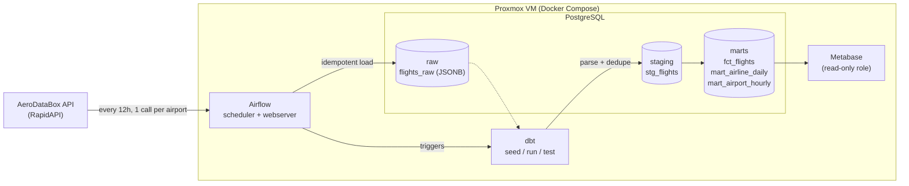

# Architecture

```mermaid
flowchart LR
    API["AeroDataBox API<br/>(RapidAPI)"]

    subgraph VM["Proxmox VM (Docker Compose)"]
        AF["Airflow<br/>scheduler + webserver"]
        subgraph PG["PostgreSQL"]
            RAW[("raw<br/>flights_raw (JSONB)")]
            STG[("staging<br/>stg_flights")]
            MART[("marts<br/>fct_flights<br/>mart_airline_daily<br/>mart_airport_hourly")]
        end
        DBT["dbt<br/>seed / run / test"]
        MB["Metabase<br/>(read-only role)"]
    end

    API -->|"every 12h, 1 call per airport"| AF
    AF -->|"idempotent load"| RAW
    AF -->|"triggers"| DBT
    DBT -->|"parse + dedupe"| STG
    STG --> MART
    RAW -.-> DBT
    MART --> MB
```
